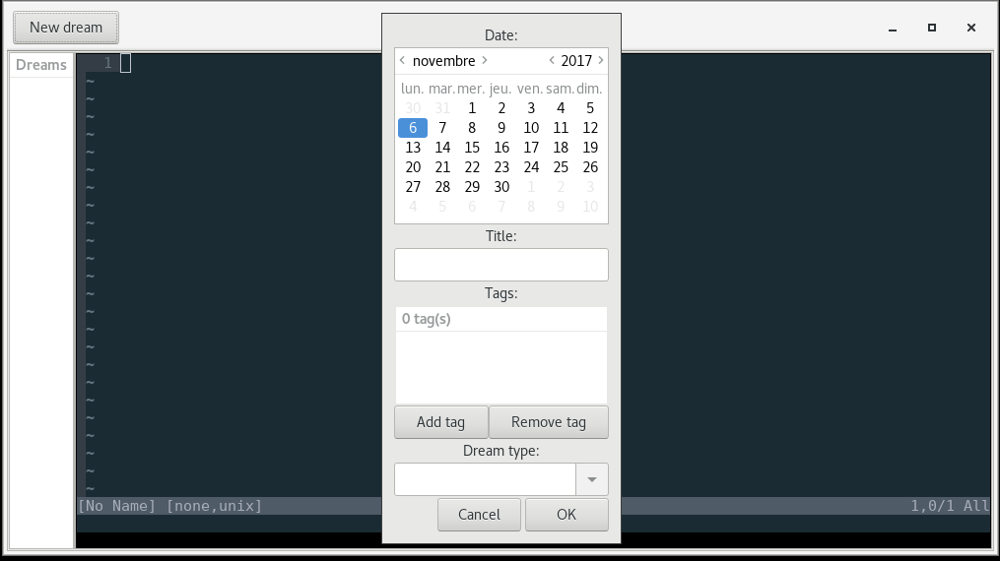

Dream Dtb
=========

A dream journal build around neovim

|gui|

Features
--------

-  Frontend to neovim
-  Dreams are stored into an sqlite database
-  Dreams can be tagged
-  Navigation tree to quickly open and edit a dream

TODO
----

-  generate a pdf from the database
-  browse dream database on a web browser like a blog
-  add a dream from the command line

